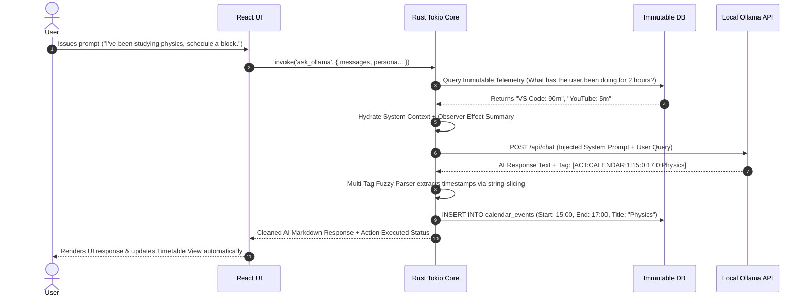

# Omni-Dashboard (Omni-Core) 

> **Omni-Dashboard is an autonomous, local-first productivity app and your veyr own AI helper. It features a background observer, strict data sovereignty, and a PiecesOS-style live memory DB designed to get that discipline to Workmaxx/Gradesmaxx.**

Welcome to the edge of productivity. If you are a student, a developer, or a professional who's tired of paying for like ten different subscription apps, constantly getting distracted, and worrying about corporations harvesting your private data, then **Omni-Core is your ultimate solution.**

## Why this fits in (For the Hack Club lmao)

Omni-Dashboard will completely replace your fragmented, cloud-dependent SaaS (Software as a Service) applications with a unified, hyper-fast,AND offline platform. With **Tauri v2** (a framework for building tiny, blazing-fast desktop apps) and a **Rust** backend, it can pair a database with a multiple Local AI models powered by **Ollama** (you need to have Ollama up and running for this with Llama3.2:3b and more downloaded). 

Beyond standard task management, Omni-Core introduces what we like to call the **Observer Effect**: is is basically an un-bypassable background tracker that logs your active screen time, categorizes your behavior (Deep Work vs. Distraction), and streams this live context directly into the AI's neural memory. So, **The AI knows what you are doing in real-time.** It provides accountability, auto-generated flashcards, automated meeting summaries, AND MORE all without ever sending a single byte of your data to the cloud.

---

## 📋 Table of Contents
1. [System Architecture & Design Philosophy](#1-system-architecture--design-philosophy)
2. [Deep Dive: Core Engineering Modules](#2-deep-dive-core-engineering-modules)
   - [2.1 Autonomous Neural Action Bridge (How the AI "Does" Things)](#21-autonomous-neural-action-bridge)
   - [2.2 Local RAG & PDF Textbook Engine (The AI Study Buddy)](#22-local-rag--pdf-textbook-engine)
   - [2.3 System Telemetry & Dynamic VRAM Purging (Crash Prevention)](#23-system-telemetry--dynamic-vram-purging)
   - [2.4 Multimodal Audio & Zero-Cloud TTS Pipeline (Offline Spotify + Voices)](#24-multimodal-audio--zero-cloud-tts-pipeline)
   - [2.5 The Observer Effect: Immutable Telemetry & Live Memory](#25-the-observer-effect-immutable-telemetry--live-memory)
   - [2.6 Advanced Automation: Flashcards & Auto-Summaries](#26-advanced-automation-flashcards--auto-summaries)
3. [Relational Database Schema (SQLite WAL)](#3-relational-database-schema-sqlite-wal)
4. [AI Persona Engine & Prompt Matrix](#4-ai-persona-engine--prompt-matrix)
5. [Tauri IPC API Reference (For Developers)](#5-tauri-ipc-api-reference)
6. [Comprehensive Setup & Build Protocol (Student-Friendly Guide)](#6-comprehensive-setup--build-protocol)
7. [Troubleshooting & CS Engineering Notes](#7-troubleshooting--cs-engineering-notes)
8. [License & Terms of Use](#8-license--terms-of-use)

---

## 1. 🏛️ System Architecture & Design Philosophy

Omni-Dashboard keeps a strict **Local-First Architecture (LFA)**, thinking of your computer as an impenetrable fortress. There are no API keys, no cloud syncing, or data harvesting. 

All application state (your tasks), vector searchs (how the AI finds information in your textbooks), user screens (what apps you are using), and chat context remain strictly confined to your laptop (or device). It uses asynchronous `tokio` threads (a Rust tool that allows multiple things to happen at once without freezing the app) to prevent the user interface from freezing when the AI is thinking hard too.

```text
┌───────────────────────────────────────────────────────────────────────────────────────────┐
│                                    REACT / TS FRONTEND                                    │
│   (Vite, Tailwind CSS, Lucide Icons, Modern Dark UI, High-Frequency Polling Hooks)        │
│   This is the beautiful visual layer you interact with, built with standard web tech.     │
└────────────────────────────────────────────┬──────────────────────────────────────────────┘
                                             │
                                             │ Tauri IPC Bridge (Asynchronous payloads)
                                             │ (The invisible messenger carrying your clicks)
                                             ▼
┌───────────────────────────────────────────────────────────────────────────────────────────┐
│                                   RUST TAURI CORE DAEMON                                  │
│                               (The high-speed brain of the app)                           │
│                                                                                           │
│  ┌───────────────────────┐  ┌───────────────────────┐  ┌───────────────────────────────┐  │
│  │   Context Hydrator    │  │  Fuzzy Action Parser  │  │  Telemetry Monitor (Tokio)    │  │
│  │ (Live Memory Inject)  │  │   ([ACT:...] Loop)    │  │ (Watches what apps you use)   │  │
│  └───────────┬───────────┘  └───────────┬───────────┘  └──────────────┬────────────────┘  │
└──────────────┼──────────────────────────┼─────────────────────────────┼───────────────────┘
               │                          │                             │
               ▼                          ▼                             ▼
┌──────────────────────────┐  ┌──────────────────────────┐  ┌───────────────────────────────┐
│  EMBEDDED SQLITE DB      │  │  OLLAMA REST API         │  │  PIPER TTS / Rodio / cpal     │
│  (WAL Mode Enabled)      │  │  (`127.0.0.1:11434`)     │  │  (ONNX Runtime / Loopback)    │
│  (Your private vault)    │  │  (The local AI models)   │  │  (The voice & music engines)  │
└──────────────────────────┘  └──────────────────────────┘  └───────────────────────────────┘

**This and a few of the following README diagrams are generated by AI**
```

### High-Fidelity Data Flow Sequence (How a Command Works)
Usually, AI like ChatGPT just spits out text, and *you* have to copy-paste it into your calendar. Omni-Core skips the you part entirely.



---

## 2. 🔬 Deep Dive: Core Engineering Modules

### 2.1 Autonomous Neural Action Bridge (How the AI "Does" Things)
Traditional AI chat systems are passive. Well, Omni-Core isn't "passive". It uses a high-reliability **Zero-Math Fuzzy Parsing Tag Execution Bridge** to let the AI actually *do* work for you.

#### Tag Format Specifications
Small, highly compressed AI models (which you need if you are running them on a normal student laptop) often hallucinate or break when trying to write complex code. To ensure 100% execution reliability, Omni-Core forces the AI to use simple, strict bracketed tags:
1. **Task Creation:** `[ACT:TASK:<QUADRANT_1_TO_4>:<TITLE>]`
2. **Calendar Scheduling:** `[ACT:CALENDAR:<OFFSET_DAYS>:<START_HOUR>:<START_MIN>:<END_HOUR>:<END_MIN>:<TITLE>]`
3. **Pomodoro Timer Ignition:** `[ACT:TIMER:<FOCUS_MINUTES>:<BREAK_MINUTES>]`
4. **Record Deletion:** `[ACT:DELETE:<TABLE_NAME>:<RECORD_ID>]`
5. **Task Completion:** `[ACT:COMPLETE:<TASK_ID>]`

#### Parsing Engine Mechanics
* **Regex-Free Tokenizer:** The Rust daemon will scan the AI's response looking for `[ACT:`. This is mathematically cheaper for your computer's CPU and highly resilient to AI mistakes.
* **AM/PM & String Normalization:** If the AI makes a mistake and types "5 PM" instead of the 24-hour "17:00", the engine automatically catches it, cleans the text, and calculates the exact mathematical timestamp.
* **Concurrency Safety:** If the AI creates 5 tasks at once, the system applies a tiny 2-millisecond delay (`std::thread::sleep`) between saving each one to guarantee they all get a unique ID in your database without colliding.

---

### 2.2 Local RAG & PDF Textbook Engine (The AI Study Buddy)
"RAG" stands for Retrieval-Augmented Generation. In plain English, it means giving the AI the ability to read your specific documents. Therefore,This can handle massive academic textbook ingestion completely on-device.

1. **Extraction & Chunking:** When you upload a 500-page Biology PDF, the `lopdf` tool scans every single page, stripping out the visual formatting to grab the pure text.
2. **Persistence:** These pages are instantly stored in your local database.
3. **Keyword Heuristic (Smart Searching):** When you attach a textbook to the chat and ask a question, the app extracts the important words from your question. It then mathematically scores every page in the book based on how often those words appear. It grabs the top 5 most relevant pages and secretly feeds them to the AI before it answers. **This forces the AI to cite specific page numbers from your actual textbook, eliminating fake answers (hallucinations).**

---

### 2.3 System Telemetry & Dynamic VRAM Purging (Crash Prevention)
Running Artificial Intelligence locally requires RAM (Memory) and VRAM (Video Memory on your Graphics Card). And, uhh,well, both of those are, let's just say, not in a good market lol, so yeah, managing them is quite necessary if you don't got pockets as deep as the Mariana Trench hehe. 

* **High-Frequency Diagnostics:** The app constantly monitors your computer's physical memory health to ensure it isn't overheating or crashing.
* **Dynamic VRAM Purging:** If you switch from a writing AI (like `llama3.2`) to a coding AI (like `qwen2.5-coder`), your computer will normally crash because it can't hold both in memory. Omni-Core actively intervenes. The instant you switch, it sends a kill-signal to the old AI model, flushing it out of your graphics card completely to make room for the new one.

---

### 2.4 Multimodal Audio & Zero-Cloud TTS Pipeline (Offline Spotify + Voices)
We also provide lightning-fast voice generation and a built-in music player.

* **Piper TTS Engine:** The AI can speak to you using offline voice models. The system does math in the background (`Length Scale = 200 / Words Per Minute`) to perfectly match your preferred listening speed.
* **YT-DLP Offline Vault:** Instead of paying for Spotify Premium, Omni-Core allows you to search YouTube Music directly inside the app. When you click download, it fetches the raw `.mp3` file directly to your hard drive. It builds an unbreakable, ad-free "Flow State" playlist vault that works perfectly even if you have no Wi-Fi (or LAN/Ethernet for the super-geeks out there).

---

### 2.5 The Observer Effect: Immutable Telemetry & Live Memory
This is the psychological stone foundation we built out of Omni-Dashboard, built specifically for procrastinating students. Psychology proves we work exponentially harder when we know we are being watched, like when you have that one teacher/manager running rings around you. Quite annoying yes, but increase productivity.

1. **The Silent Watcher Thread:** It's basically a detached, invisible loop that runs continuously in the background of your computer. Every 10 seconds, it asks your operating system: *"What app/website is the user looking at right now?"*
2. **Behavioral Categorization:** It categorizes your behavior automatically. Using VS Code or reading a PDF? Tagged as **"Deep Work"**. Scrolling Twitter or YouTube? Tagged as **"Distraction"**.
3. **Immutable Persistence:** This data is written into the `immutable_telemetry` table in your database. **There is no delete button.** You cannot hide your distractions from the system. You cannot lie to yourself about how much you studied. Well, unless you find out how to get to system files, but if you are willing to go there, nobody can help you lol.
4. **Live Memory Stream:** Just like high-end tools (PiecesOS or Windows Recall), Omni-Core rolls up your recent activity into a summary. When you ask the AI for advice, it secretly injects: *"The user has spent 45m in VS Code, and 12m on YouTube."* **The AI is fully aware of your real-time behavior.** It will proactively suggest a break if you are overworked, or harshly scold you (depends on persona heavily tho, [side-note, please don't go for Victor lol, he's the strictest of all of them. We built him as a test-subject and kept him there, just for fun]) if you've been slacking off.

---

### 2.6 Advanced Automation: Flashcards & Auto-Summaries
It uses your raw data to do your homework for you.
* **Auto-Flashcard Generation:** By analyzing the notes you take in the app and the RAG textbook extracts, the AI autonomously formats and spits out ready-to-study flashcard arrays.
* **Meeting & Class Summarization:** Hit the "AI Summarize" button on any class note, and the system packages the raw text, queries the High-Performance AI model, and appends a deeply structured, bulleted list of key takeaways to the bottom of your document.
* **Future Audio Loopback:** The system is wired to eventually capture your computer's internal audio (WASAPI loopback). This means it will listen to your Zoom classes and transcribe them live.

---

## 3. 💾 Relational Database Schema (SQLite WAL)

The database utilizes SQLite configured for Write-Ahead Logging (WAL). In simple terms: it allows the invisible background telemetry thread to write your screen-time logs at the exact same time you are reading a chat message, without locking up or crashing the app.

```sql
CREATE TABLE IF NOT EXISTS tasks (
    id TEXT PRIMARY KEY,
    title TEXT NOT NULL,
    quadrant INTEGER NOT NULL, -- 1: Do First, 2: Schedule, 3: Delegate, 4: Eliminate
    completed INTEGER NOT NULL
);

CREATE TABLE IF NOT EXISTS notes (
    id TEXT PRIMARY KEY,
    title TEXT NOT NULL,
    content TEXT NOT NULL,
    course_id TEXT NOT NULL
);

CREATE TABLE IF NOT EXISTS courses (
    id TEXT PRIMARY KEY,
    code TEXT NOT NULL,
    name TEXT NOT NULL,
    description TEXT NOT NULL,
    color TEXT NOT NULL
);

CREATE TABLE IF NOT EXISTS workspaces (
    id TEXT PRIMARY KEY,
    name TEXT NOT NULL,
    created_at INTEGER NOT NULL
);

CREATE TABLE IF NOT EXISTS chat_sessions (
    id TEXT PRIMARY KEY,
    title TEXT NOT NULL,
    workspace_id TEXT NOT NULL DEFAULT '',
    created_at INTEGER NOT NULL,
    updated_at INTEGER NOT NULL
);

CREATE TABLE IF NOT EXISTS chats (
    id TEXT PRIMARY KEY,
    session_id TEXT NOT NULL DEFAULT 'default_session',
    role TEXT NOT NULL,
    content TEXT NOT NULL,
    timestamp INTEGER NOT NULL
);

CREATE TABLE IF NOT EXISTS settings (
    key TEXT PRIMARY KEY,
    value TEXT NOT NULL
);

CREATE TABLE IF NOT EXISTS focus_sessions (
    id TEXT PRIMARY KEY,
    task_id TEXT NOT NULL,
    duration_minutes INTEGER NOT NULL,
    timestamp INTEGER NOT NULL,
    title TEXT
);

CREATE TABLE IF NOT EXISTS playlists (
    id TEXT PRIMARY KEY,
    name TEXT NOT NULL,
    tags TEXT NOT NULL DEFAULT '[]',
    songs TEXT NOT NULL DEFAULT '[]',
    created_at INTEGER NOT NULL
);

CREATE TABLE IF NOT EXISTS offline_songs (
    id TEXT PRIMARY KEY,
    title TEXT NOT NULL,
    artist TEXT NOT NULL,
    duration TEXT NOT NULL,
    local_path TEXT NOT NULL,
    thumbnail_url TEXT NOT NULL,
    source TEXT NOT NULL
);

CREATE TABLE IF NOT EXISTS textbooks (
    id TEXT PRIMARY KEY,
    title TEXT NOT NULL,
    author TEXT NOT NULL,
    course_id TEXT NOT NULL,
    file_path TEXT NOT NULL,
    total_pages INTEGER NOT NULL,
    created_at INTEGER NOT NULL
);

CREATE TABLE IF NOT EXISTS textbook_pages (
    id TEXT PRIMARY KEY,
    textbook_id TEXT NOT NULL,
    page_number INTEGER NOT NULL,
    content TEXT NOT NULL
);

CREATE TABLE IF NOT EXISTS book_sets (
    id TEXT PRIMARY KEY,
    name TEXT NOT NULL,
    created_at INTEGER NOT NULL
);

CREATE TABLE IF NOT EXISTS book_set_items (
    set_id TEXT NOT NULL,
    textbook_id TEXT NOT NULL,
    PRIMARY KEY (set_id, textbook_id)
);

CREATE TABLE IF NOT EXISTS calendar_events (
    id TEXT PRIMARY KEY,
    title TEXT NOT NULL,
    description TEXT NOT NULL DEFAULT '',
    start_time INTEGER NOT NULL, -- Unix epoch time in milliseconds
    end_time INTEGER NOT NULL,   -- Unix epoch time in milliseconds
    event_type TEXT NOT NULL,
    tags TEXT NOT NULL DEFAULT '[]',
    color TEXT NOT NULL DEFAULT '#3b82f6',
    is_all_day INTEGER NOT NULL DEFAULT 0
);

CREATE TABLE IF NOT EXISTS immutable_telemetry (
    id TEXT PRIMARY KEY,
    timestamp INTEGER NOT NULL,
    app_name TEXT NOT NULL,
    window_title TEXT NOT NULL,
    category TEXT NOT NULL -- Tags: "Deep Work", "Research", "Leisure", "Distraction"
);

CREATE TABLE IF NOT EXISTS live_memory_summaries (
    id TEXT PRIMARY KEY,
    timestamp INTEGER NOT NULL,
    summary_text TEXT NOT NULL
);
```

---

## 4. 🎭 AI Persona Engine & Prompt Matrix

Omni-Core features 10 distinctly engineered AI personalities. Different studying situations require different coaching styles. Changing the persona literally changes the hidden "System Prompt" fed to the AI. 

| Persona | Gender & Style | Dynamic Voice Model | System Archetype & Behavioral Objective |
| :--- | :--- | :--- | :--- |
| **Victor** | Strict Male | `en_US-bryce-medium` | Tactical drill-sergeant mentor. Uncompromising precision, zero fluff, demands strict task accountability. **Utilizes telemetry to harshly penalize your distractions.** |
| **Morgan** | Strict Female | `en_US-amy-medium` | Executive strategist and professor. Focuses on intellectual rigor, logic, and rapid execution. Ideal for academic textbook extraction. |
| **Sam** | Normal Male | `en_US-ryan-high` | Approachable roommate. Balanced guidance using clear analogies and friendly conversational tone. |
| **Maya** | Normal Female | `en_GB-semaine-medium` | Empathetic study mentor. Structured learning support, clear organization, and articulate explanations. **Excellent for generating study flashcards.** |
| **Leo** | Quirky Male | `en_US-joe-medium` | Sarcastic, hackathon-tier developer. Dry wit, deadpan humor, highly efficient code and problem solving. Maps perfectly to coding tasks. |
| **Felix** | Quirky Male | `en_GB-alan-medium` | High-energy tech tinkerer. Uses analogies, pop-culture metaphors, and rapid structural breakdowns. |
| **Ziggy** | Quirky Male | `en_US-danny-low` | Indie radio philosopher. Deep conceptual curiosity, surrealist humor, and calm problem-solving. |
| **Nova** | Quirky Female | `en_GB-cori-high` | High-octane hype-woman. Fast-paced banter, dramatic flair, intense positive motivation. **Best utilized for maintaining momentum during long 2-hour Pomodoro study sessions.** |
| **Aria** | Quirky Female | `en_GB-alba-medium` | Theatrical mad scientist. Treats productivity, tasks, and notes as scientific experiments. |
| **Chloe** | Quirky Female | `en_GB-jenny_dioco-medium` | Brutally honest sister figure. Calls out procrastination instantly based on active-window telemetry, offers zero-filter advice with affectionate humor. |

---

## 5. 🔌 Tauri IPC API Reference (For Developers)

The visual frontend interacts with the hidden Rust engine via IPC (you can google it, pretty tuff stuff for us to explain). Every function is strictly typed and handles potential software errors gracefully.

### System & Telemetry Commands
```typescript
//Checking your RAM
invoke("get_telemetry"): Promise<{ ram_total: string, ram_used: string, ram_percent: number }>;

//The Observer Effect
invoke("get_active_app_telemetry"): Promise<AppTelemetry>;

// Payload delivery to Ollama to unload heavy AI models instantly
invoke("flush_vram", { modelTier: string }): Promise<void>;

// Profile Configuration
invoke("get_settings"): Promise<UserSettings>;
invoke("save_settings", { settings: UserSettings }): Promise<void>;
```

### AI, Action Bridge, & Chat Commands
```typescript
invoke("ask_ollama", {
  messages: Array<{ role: string, content: string }>,
  persona: string,
  modelTier: string,
  searchWeb: boolean,
  attachedTextbook?: TextbookAttachment,
  currentDateStr: string,
  currentEpochMs: number,
  startOfTodayMs: number // Critical for calculating calendar timestamps dynamically
}): Promise<string>;
```

### Productivity & Calendar Matrix Commands
```typescript
//Priority Matrix Interactions
invoke("get_tasks"): Promise<TaskItem[]>;
invoke("add_task", { id: string, title: string, quadrant: number }): Promise<void>;
invoke("delete_task", { id: string }): Promise<void>;

// Advanced Timetable Interactions
invoke("add_calendar_event", {
  id: string, title: string, description: string, start_time: number,
  end_time: number, event_type: string, tags: string[], color: string, is_all_day: boolean
}): Promise<void>;
invoke("get_calendar_events_in_range", { start: number, end: number }): Promise<CalendarEventItem[]>;
invoke("delete_calendar_event", { id: string }): Promise<void>;
```

### Document Ingestion & Storage Commands
```typescript
invoke("import_pdf_textbook", { filePath: string, title: string, author: string, courseId: string }): Promise<TextbookItem>;
invoke("get_textbooks"): Promise<TextbookItem[]>;
invoke("delete_textbook", { id: string }): Promise<void>;
```

### Audio Pipeline Commands
```typescript
//generate artificial voices
invoke("read_aloud", { text: string, wpm: number, persona: string }): Promise<void>;
invoke("stop_reading"): Promise<void>;

// Invokes native yt-dlp binary to rip raw .mp3 data from YouTube
invoke("download_yt_song", { videoId: string, title: string, artist: string, duration: string, thumbnailUrl: string }): Promise<OfflineSongItem>;
```

---

## 6. ⚙️ Comprehensive Setup & Build Protocol (Student-Friendly Guide)

Don't panic if you saw the code, and were like nahh. Setting this up requires a few tools, but it will give you complete ownership of your productivity.

### 6.1 Host System Prerequisites
Omni-Core compiles directly against your computer's operating system. You need to install these foundational tools:
* **Node.js:** (Version 18 or higher). This runs the user interface.
* **Rust Toolchain:** Install via `rustup`. This is the language the heavy-lifting engine is written in.
* **C++ Build Tools:** If you are on Windows, download the *Visual Studio Build Tools* and check the box that says "Desktop development with C++". This is strictly required for your computer to understand the audio engines.
* **Git LFS:** Required to download the massive AI voice files.

```bash
# Open your terminal and type this to initialize Git LFS before cloning
git lfs install
```

---

### 6.2 Ollama Environment Setup
[Ollama](https://ollama.com/) is the tool that lets you run large language models on your laptop without the internet. Install it, open your terminal, and pre-fetch the specific AI brains Omni-Core uses:

```bash
# The General conversational brain (Fast reasoning)
ollama pull llama3.2:3b

# The Coding & Logic brain (Used for math and development)
ollama pull qwen2.5-coder:3b

# The High Performance brain (Ultra-fast execution)
ollama pull phi4-mini:latest

# The Image Engine (For the image scanning, and Hotkey pullup)

ollama pull qwen3.5:2b

# The Textbook Scanner brain (Used for RAG and PDFs)
ollama pull nemotron-mini:latest
```


---

### 6.3 Piper TTS Runtime Setup
Verify the `piper` directory structure within the `src-tauri` folder. If the `.onnx` voice models are missing, you will need to download them from the Rhasspy Piper repository and place them inside the `voices` folder.

```text
src-tauri/
└── piper/
    ├── piper/
    │   └── piper.exe
    └── voices/
        ├── en_US-ryan-high.onnx
        ├── en_US-amy-medium.onnx
        ├── en_US-bryce-medium.onnx
```

---

### 6.4 Development Compilation

Launch the application in development mode. The system handles hot-reloading (updating the screen instantly when code changes).

```bash
# 1. Download the code to your computer
git clone [https://github.com/Koundinya-Git/omni-dashboard.git](https://github.com/Koundinya-Git/omni-dashboard.git)

# 2. Enter the project folder
cd omni-dashboard

# 3. Install the required web packages
npm install

# 4. Launch the application!
npm run tauri dev
```

---

### 6.5 Production Executable (.exe) Compilation

If you want to create a normal `.exe` file that you can double click and run like a normal app (without opening the terminal):

```bash
npm run tauri build
```

The system will compress everything and place your installer in: `src-tauri/target/release/bundle/msi/`. Or if you are too lazy, get our latest release binaries (.exe only though for now).

---

## 7. 🛠️ Troubleshooting & CS Engineering Notes

### "link.exe not found" Error
* **Cause:** You skipped installing the MSVC C++ Build Tools in Step 6.1.
* **Fix:** Open Visual Studio Installer -> Workloads -> Check "Desktop development with C++" -> Modify/Install.

### "Network request failed" when talking to the AI
* **Cause:** Your Ollama app is closed or not running in the background.
* **Fix:** Open your terminal and type `ollama serve` to manually turn on the AI listener.

### Database is "Locked" or Freezing
* **Cause:** The invisible background observer thread and your chat thread tried to write data at the exact same millisecond. 
* **Fix:** Omni-Core uses SQLite WAL (Write-Ahead Logging) to prevent this. If it happens, simply restart the app.

---
## 8. Images of Project:


---
## 9. License & Terms of Use

This project is open-source software licensed under the **GNU General Public License v3 (GPLv3)** with explicit additional terms as permitted under **GPLv3 Section 7**. Please refer to `Terms_and_Conditions.md` for complete legal definitions and liability waivers regarding AI hallucination, database management, and active telemetry tracking. By using, cloning, or compiling this application, you explicitly agree to the said Terms and Conditions in the `Terms_and_Conditions.md` file.

```text
GNU GENERAL PUBLIC LICENSE
Version 3, 29 June 2007

Copyright (C) 2026 Koundinya Gajulapalli

===============================================================================
ADDITIONAL TERMS UNDER GPLv3 SECTION 7
===============================================================================

1. Mandatory Title Preservation (§7c):
   Any modified version, derivative work, or reproduction of this software that 
   is distributed or published must explicitly retain and prominently display 
   the phrase "Omni-Dashboard" within its primary title and naming identifiers.

2. Visible User-Facing Attribution (§7b):
   Distributors and developers of modified versions must preserve and display 
   clear, noticeable attribution to the original creator (Koundinya Gajulapalli) and provide 
   a direct link to the original repository within the user-facing interface 
   of the application (e.g., in the "About", "Settings", or "Dashboard" sections).
```

---
*Omni-Core Architecture Engine • Designed for Local Sovereignty and Maximum Student Discipline*
