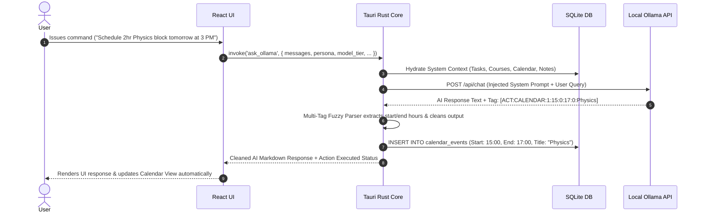

# Omni-Dashboard (Omni-Core) 🧠⚡

> **Omni-Dashboard is an autonomous, local-first executive productivity operating system and AI telemetry engine.**

Omni-Dashboard (Omni-Core) is a high-performance desktop platform designed to eliminate cloud dependencies, SaaS subscription models, and telemetry tracking. Built using **Tauri v2** and **Rust**, it combines an embedded relational database with a multi-tiered local Large Language Model (LLM) orchestration engine powered by **Ollama**, a zero-cloud Text-to-Speech (TTS) runtime, a local Retrieval-Augmented Generation (RAG) pipeline for PDF textbook synthesis, and an autonomous neural action execution bridge.

---

## 📋 Table of Contents
1. [System Architecture & Design Philosophy](#-system-architecture--design-philosophy)
2. [Deep Dive: Engineering Modules](#-deep-dive-engineering-modules)
   - [Autonomous Neural Action Bridge](#21-autonomous-neural-action-bridge)
   - [Local RAG & PDF Textbook Engine](#22-local-rag--pdf-textbook-engine)
   - [System Telemetry & Dynamic VRAM Management](#23-system-telemetry--dynamic-vram-management)
   - [Multimodal Audio & TTS Pipeline](#24-multimodal-audio--tts-pipeline)
3. [Relational Database Schema](#-relational-database-schema)
4. [AI Persona Engine & Prompt Matrix](#-ai-persona-engine--prompt-matrix)
5. [Tauri IPC API Reference](#-tauri-ipc-api-reference)
6. [Comprehensive Setup & Build Protocol](#-comprehensive-setup--build-protocol)
   - [Host System Prerequisites](#1-host-system-prerequisites)
   - [Ollama Environment Setup](#2-ollama-environment-setup)
   - [Piper TTS Runtime Setup](#3-piper-tts-runtime-setup)
   - [Development Compilation](#4-development-compilation)
   - [Production Executable (.exe) Compilation](#5-production-executable-exe-compilation)
7. [Troubleshooting & CS Engineering Notes](#-troubleshooting--cs-engineering-notes)
8. [License & Terms of Use](#-license--terms-of-use)

---

## 🏛️ System Architecture & Design Philosophy

Omni-Dashboard utilizes a strict **Local-First Architecture (LFA)**. All application state, vector search heuristics, user telemetry, and chat context remain strictly confined to the host host environment via embedded SQLite and local process runtimes.

```
┌───────────────────────────────────────────────────────────────────────────────────┐
│                                 REACT / TS FRONTEND                               │
│                (Vite, Tailwind CSS, Lucide Icons, Modern Dark UI)                 │
└────────────────────────────────────────┬──────────────────────────────────────────┘
                                         │
                                         │ Tauri IPC Bridge
                                         │ (`@tauri-apps/api/core`)
                                         ▼
┌───────────────────────────────────────────────────────────────────────────────────┐
│                                RUST TAURI CORE DAEMON                             │
│                                                                                   │
│  ┌───────────────────────┐  ┌───────────────────────┐  ┌───────────────────────┐  │
│  │   Context Hydrator    │  │  Fuzzy Action Parser  │  │  Telemetry Monitor    │  │
│  │  (System Prompt Inject)│  │   ([ACT:...] Loop)    │  │       (sysinfo)       │  │
│  └───────────┬───────────┘  └───────────┬───────────┘  └───────────┬───────────┘  │
└──────────────┼──────────────────────────┼──────────────────────────┼──────────────┘
               │                          │                          │
               ▼                          ▼                          ▼
┌──────────────────────────┐  ┌──────────────────────────┐  ┌──────────────────────────┐
│  EMBEDDED SQLITE DB      │  │  OLLAMA REST API         │  │  PIPER TTS & RODIO       │
│  (`omni_core.db`)        │  │  (`127.0.0.1:11434`)     │  │  (ONNX Audio Runtime)    │
└──────────────────────────┘  └──────────────────────────┘  └──────────────────────────┘
```

### Data Flow Sequence


---

## 🔬 Deep Dive: Engineering Modules

### 2.1 Autonomous Neural Action Bridge
Traditional AI chat systems output unstructured text, requiring human intervention to update UI state. Omni-Core solves this using a **Zero-Math Fuzzy Parsing Tag Execution Bridge**.

#### Tag Format Specifications
1. **Task Creation:** `[ACT:TASK:<QUADRANT_1_TO_4>:<TITLE>]`
2. **Calendar Scheduling:** `[ACT:CALENDAR:<OFFSET_DAYS>:<START_HOUR>:<START_MIN>:<END_HOUR>:<END_MIN>:<TITLE>]`
3. **Pomodoro Timer Ignition:** `[ACT:TIMER:<FOCUS_MINUTES>:<BREAK_MINUTES>]`
4. **Record Deletion:** `[ACT:DELETE:<TABLE_NAME>:<RECORD_ID>]`
5. **Task Completion:** `[ACT:COMPLETE:<TASK_ID>]`

#### Parsing Engine Mechanics
* **Regex-Free Tokenizer:** The Rust daemon scans model outputs using `.find("[ACT:")` string window slicing to ensure stability across small (3B parameter) quantized LLMs.
* **AM/PM & String Normalization:** The parser cleans hallucinated quote characters, normalizes 12-hour AM/PM inputs to 24-hour timestamps, and automatically adjusts start/end boundary inversions.
* **Concurrency Safety:** Multi-action responses loop sequentially within a single thread lock, applying a `std::thread::sleep(Duration::from_millis(2))` buffer to ensure unique Unix Epoch ID generation per row.

---

### 2.2 Local RAG & PDF Textbook Engine
Omni-Core handles textbook ingestion completely on-device without vector database server dependencies.

```
  [User PDF File]
         │
         ▼
┌──────────────────┐
│  lopdf Extractor │  <-- Parses raw text structure per page
└────────┬─────────┘
         │
         ▼
┌──────────────────┐
│ SQLite Database  │  <-- Persists into `textbook_pages` (page_number, content)
└────────┬─────────┘
         │
         ▼ (Query Execution)
┌──────────────────┐
│ Keyword Scorer   │  <-- Ranks pages based on term occurrence matching user prompt
└────────┬─────────┘
         │
         ▼
┌──────────────────┐
│ Context Injector │  <-- Injects top 5 ranked page extracts directly into LLM Prompt
└──────────────────┘
```

1. **Extraction:** The `lopdf` crate parses uploaded PDF structures, iterating through page trees to extract raw string buffers.
2. **Persistence:** Pages are stored in the `textbook_pages` table mapped to `textbook_id` and `page_number`.
3. **Retrieval Heuristic:** When a document is attached during chat, the backend extracts alphanumeric keywords from the user prompt, executes a frequency scoring algorithm across stored pages, ranks page relevance, and injects the top extracts into the Ollama system context window alongside strict page-number citation directives.

---

### 2.3 System Telemetry & Dynamic VRAM Management

#### Memory Diagnostics
The backend invokes `sysinfo::System` during IPC telemetry polls to calculate exact physical RAM utilization:
$$\text{RAM Usage \%} = \left( \frac{\text{Memory}_{\text{used}}}{\text{Memory}_{\text{total}}} \right) \times 100$$

#### Active VRAM Purging
To prevent GPU Out-Of-Memory (OOM) faults when switching between model tiers (e.g., from `llama3.2:3b` to `qwen2.5-coder:3b`), the `flush_vram` Tauri command issues a payload to Ollama's API:
```json
{
  "model": "previous_model_name",
  "keep_alive": 0
}
```
This forces Ollama to unload model weights from GPU memory instantly.

---

### 2.4 Multimodal Audio & TTS Pipeline

* **Piper TTS Engine:** High-speed, localized voice synthesis running native ONNX models through a subprocess invocation with custom length scales calculated as:
$$\text{Length Scale} = \frac{200}{\text{WPM}}$$
* **Rodio Audio Streamer:** Generated `.wav` outputs are piped directly into an isolated thread managing a `rodio::OutputStream` sink, providing low-latency playback controls.
* **YT-DLP Music Cache:** Music tracks are queried directly via `yt-dlp` using JSON dumping flags (`--dump-json --flat-playlist`), while offline downloads are saved directly into the application's local `music_cache/` directory.

---

## 💾 Relational Database Schema

The database is built on SQLite (`omni_core.db`) via `rusqlite`.

```sql
CREATE TABLE IF NOT EXISTS tasks (
    id TEXT PRIMARY KEY,
    title TEXT NOT NULL,
    quadrant INTEGER NOT NULL, -- 1: Do First, 2: Schedule, 3: Delegate, 4: Eliminate
    completed INTEGER NOT NULL
);

CREATE TABLE IF NOT EXISTS notes (
    id TEXT PRIMARY KEY,
    title TEXT NOT NULL,
    content TEXT NOT NULL,
    course_id TEXT NOT NULL
);

CREATE TABLE IF NOT EXISTS courses (
    id TEXT PRIMARY KEY,
    code TEXT NOT NULL,
    name TEXT NOT NULL,
    description TEXT NOT NULL,
    color TEXT NOT NULL
);

CREATE TABLE IF NOT EXISTS workspaces (
    id TEXT PRIMARY KEY,
    name TEXT NOT NULL,
    created_at INTEGER NOT NULL
);

CREATE TABLE IF NOT EXISTS chat_sessions (
    id TEXT PRIMARY KEY,
    title TEXT NOT NULL,
    workspace_id TEXT NOT NULL DEFAULT '',
    created_at INTEGER NOT NULL,
    updated_at INTEGER NOT NULL
);

CREATE TABLE IF NOT EXISTS chats (
    id TEXT PRIMARY KEY,
    session_id TEXT NOT NULL DEFAULT 'default_session',
    role TEXT NOT NULL,
    content TEXT NOT NULL,
    timestamp INTEGER NOT NULL
);

CREATE TABLE IF NOT EXISTS settings (
    key TEXT PRIMARY KEY,
    value TEXT NOT NULL
);

CREATE TABLE IF NOT EXISTS focus_sessions (
    id TEXT PRIMARY KEY,
    task_id TEXT NOT NULL,
    duration_minutes INTEGER NOT NULL,
    timestamp INTEGER NOT NULL,
    title TEXT
);

CREATE TABLE IF NOT EXISTS playlists (
    id TEXT PRIMARY KEY,
    name TEXT NOT NULL,
    tags TEXT NOT NULL DEFAULT '[]',
    songs TEXT NOT NULL DEFAULT '[]',
    created_at INTEGER NOT NULL
);

CREATE TABLE IF NOT EXISTS offline_songs (
    id TEXT PRIMARY KEY,
    title TEXT NOT NULL,
    artist TEXT NOT NULL,
    duration TEXT NOT NULL,
    local_path TEXT NOT NULL,
    thumbnail_url TEXT NOT NULL,
    source TEXT NOT NULL
);

CREATE TABLE IF NOT EXISTS textbooks (
    id TEXT PRIMARY KEY,
    title TEXT NOT NULL,
    author TEXT NOT NULL,
    course_id TEXT NOT NULL,
    file_path TEXT NOT NULL,
    total_pages INTEGER NOT NULL,
    created_at INTEGER NOT NULL
);

CREATE TABLE IF NOT EXISTS textbook_pages (
    id TEXT PRIMARY KEY,
    textbook_id TEXT NOT NULL,
    page_number INTEGER NOT NULL,
    content TEXT NOT NULL
);

CREATE TABLE IF NOT EXISTS book_sets (
    id TEXT PRIMARY KEY,
    name TEXT NOT NULL,
    created_at INTEGER NOT NULL
);

CREATE TABLE IF NOT EXISTS book_set_items (
    set_id TEXT NOT NULL,
    textbook_id TEXT NOT NULL,
    PRIMARY KEY (set_id, textbook_id)
);

CREATE TABLE IF NOT EXISTS calendar_events (
    id TEXT PRIMARY KEY,
    title TEXT NOT NULL,
    description TEXT NOT NULL DEFAULT '',
    start_time INTEGER NOT NULL, -- Unix epoch time in milliseconds
    end_time INTEGER NOT NULL,   -- Unix epoch time in milliseconds
    event_type TEXT NOT NULL,
    tags TEXT NOT NULL DEFAULT '[]',
    color TEXT NOT NULL DEFAULT '#3b82f6',
    is_all_day INTEGER NOT NULL DEFAULT 0
);
```

---

## 🎭 AI Persona Engine & Prompt Matrix

Omni-Core features 10 distinct AI personas, mapped dynamically to hardware model tiers.

| Persona | Gender & Style | Dynamic Voice Model | System Archetype & Behavioral Objective |
| :--- | :--- | :--- | :--- |
| **Victor** | Strict Male | `en_US-bryce-medium` | Tactical drill-sergeant mentor. Uncompromising precision, zero fluff, demands strict task accountability. |
| **Morgan** | Strict Female | `en_US-amy-medium` | Executive strategist and professor. Focuses on intellectual rigor, logic, and rapid execution. |
| **Sam** | Normal Male | `en_US-ryan-high` | Approachable roommate. Balanced guidance using clear analogies and friendly conversational tone. |
| **Maya** | Normal Female | `en_GB-semaine-medium` | Empathetic study mentor. Structured learning support, clear organization, and articulate explanations. |
| **Leo** | Quirky Male | `en_US-joe-medium` | Sarcastic, hackathon-tier developer. Dry wit, deadpan humor, highly efficient code and problem solving. |
| **Felix** | Quirky Male | `en_GB-alan-medium` | High-energy tech tinkerer. Uses analogies, pop-culture metaphors, and rapid structural breakdowns. |
| **Ziggy** | Quirky Male | `en_US-danny-low` | Indie radio philosopher. Deep conceptual curiosity, surrealist humor, and calm problem-solving. |
| **Nova** | Quirky Female | `en_GB-cori-high` | High-octane hype-woman. Fast-paced banter, dramatic flair, intense positive motivation. |
| **Aria** | Quirky Female | `en_GB-alba-medium` | Theatrical mad scientist. Treats productivity, tasks, and notes as scientific experiments. |
| **Chloe** | Quirky Female | `en_GB-jenny_dioco-medium` | Brutally honest sister figure. Calls out procrastination, offers zero-filter advice with affectionate humor. |

---

## 🔌 Tauri IPC API Reference

The frontend interacts with the Rust backend daemon via strong IPC command interfaces:

### System & Telemetry Commands
```typescript
invoke("get_telemetry"): Promise<{ ram_total: string, ram_used: string, ram_percent: number }>;
invoke("flush_vram", { modelTier: string }): Promise<void>;
invoke("get_settings"): Promise<UserSettings>;
invoke("save_settings", { settings: UserSettings }): Promise<void>;
```

### AI & Chat Commands
```typescript
invoke("ask_ollama", {
  messages: Array<{ role: string, content: string }>,
  persona: string,
  modelTier: string,
  searchWeb: boolean,
  attachedTextbook?: TextbookAttachment,
  currentDateStr: string,
  currentEpochMs: number,
  startOfTodayMs: number
}): Promise<string>;
```

### Task & Eisenhower Matrix Commands
```typescript
invoke("get_tasks"): Promise<TaskItem[]>;
invoke("add_task", { id: string, title: string, quadrant: number }): Promise<void>;
invoke("delete_task", { id: string }): Promise<void>;
```

### Calendar & Time-Blocking Commands
```typescript
invoke("add_calendar_event", {
  id: string, title: string, description: string, start_time: number,
  end_time: number, event_type: string, tags: string[], color: string, is_all_day: boolean
}): Promise<void>;
invoke("get_calendar_events_in_range", { start: number, end: number }): Promise<CalendarEventItem[]>;
invoke("delete_calendar_event", { id: string }): Promise<void>;
```

### RAG Textbook Vault Commands
```typescript
invoke("import_pdf_textbook", { filePath: string, title: string, author: string, courseId: string }): Promise<TextbookItem>;
invoke("get_textbooks"): Promise<TextbookItem[]>;
invoke("delete_textbook", { id: string }): Promise<void>;
```

### Audio & TTS Commands
```typescript
invoke("read_aloud", { text: string, wpm: number, persona: string }): Promise<void>;
invoke("stop_reading"): Promise<void>;
invoke("download_yt_song", { videoId: string, title: string, artist: string, duration: string, thumbnailUrl: string }): Promise<OfflineSongItem>;
```

---

## ⚙️ Comprehensive Setup & Build Protocol

### 1. Host System Prerequisites
Install the required system toolchains:
* **Node.js:** `v18.0.0+`
* **Rust Toolchain:** Install via `rustup` (`cargo`, `rustc` edition 2021).
* **C++ Build Tools:** Visual Studio Build Tools (Windows) with "Desktop development with C++" workload selected (required for MSVC crate compilation).
* **Git LFS:** Required to fetch Piper TTS voice binaries.

```bash
git lfs install
```

---

### 2. Ollama Environment Setup
Install [Ollama](https://ollama.com/) and pre-fetch the model suite required for all functional tiers:

```bash
# General / Default Tier
ollama pull llama3.2:3b

# Coding & Logic Tier
ollama pull qwen2.5-coder:3b

# High Performance Tier
ollama pull phi4-mini:latest

# Document RAG Tier
ollama pull nemotron-mini:latest

# Multimodal / Vision Tier
ollama pull qwen3.5:4b
```

---

### 3. Piper TTS Runtime Setup
Verify the Piper directory structure within `src-tauri`:

```
src-tauri/
└── piper/
    ├── piper/
    │   └── piper.exe
    └── voices/
        ├── en_US-ryan-high.onnx
        ├── en_US-amy-medium.onnx
        ├── en_US-bryce-medium.onnx
        └── ... (other persona models)
```

---

### 4. Development Compilation

```bash
# 1. Clone the repository
git clone [https://github.com/Koundinya-Git/omni-dashboard.git](https://github.com/Koundinya-Git/omni-dashboard.git)
cd omni-dashboard

# 2. Install Node dependencies
npm install

# 3. Launch Tauri Development Server
npm run tauri dev
```

---

### 5. Production Executable (.exe) Compilation

To compile a native standalone Windows binary:

```bash
npm run tauri build
```

#### Output Artifact Directories:
* **Standalone Binary:** `src-tauri/target/release/omni-dashboard.exe`
* **MSI Installer Package:** `src-tauri/target/release/bundle/msi/omni-dashboard_0.1.0_x64_en-US.msi`

---

## 🛠️ Troubleshooting & CS Engineering Notes

### 1. Rust Compiler Linker Fault (`link.exe not found`)
* **Cause:** Missing MSVC C++ Build Tools.
* **Fix:** Open Visual Studio Installer $\rightarrow$ Workloads $\rightarrow$ Check "Desktop development with C++" $\rightarrow$ Modify/Install.

### 2. Ollama Connection Timeout (`Network request failed`)
* **Cause:** Ollama daemon is not running on localhost port 11434.
* **Fix:** Run `ollama serve` in a terminal window to establish the REST service listener on `127.0.0.1:11434`.

### 3. Git Push Failures (Files > 100MB)
* **Cause:** Pushing raw `.onnx` binaries without Git LFS pointers initialized in history.
* **Fix:** Ensure `.gitattributes` tracks `*.onnx` and commit via `git lfs track "*.onnx"`.

---

## ⚖️ License & Terms of Use

This project is open-source software licensed under the **GNU General Public License v3 (GPLv3)** with explicit additional terms as permitted under **GPLv3 Section 7**. Please refer to "Terms_and_Conditions.md" for further details. By using this application, you agree to the said Terms and Conditions in the said "Terms_and_Conditions.md" file.


```markdown
GNU GENERAL PUBLIC LICENSE
Version 3, 29 June 2007

Copyright (C) 2026 Koundinya Gajulapalli

===============================================================================
ADDITIONAL TERMS UNDER GPLv3 SECTION 7
===============================================================================

1. Mandatory Title Preservation (§7c):
   Any modified version, derivative work, or reproduction of this software that 
   is distributed or published must explicitly retain and prominently display 
   the phrase "Omni-Dashboard" within its primary title and naming identifiers.

2. Visible User-Facing Attribution (§7b):
   Distributors and developers of modified versions must preserve and display 
   clear, noticeable attribution to the original creator (Koundinya Gajulapalli) and provide 
   a direct link to the original repository within the user-facing interface 
   of the application (e.g., in the "About", "Settings", or "Dashboard" sections).
```

---
*Omni-Core Architecture Engine • Designed for Local Sovereignty*